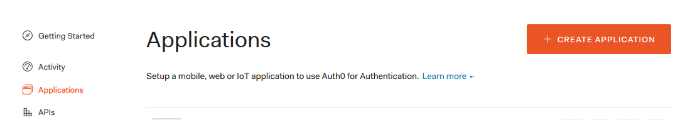
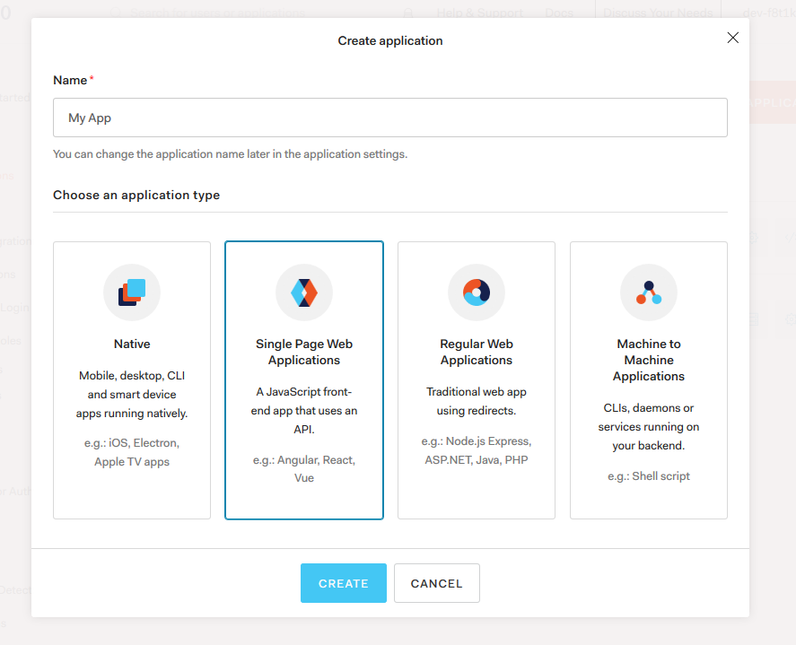
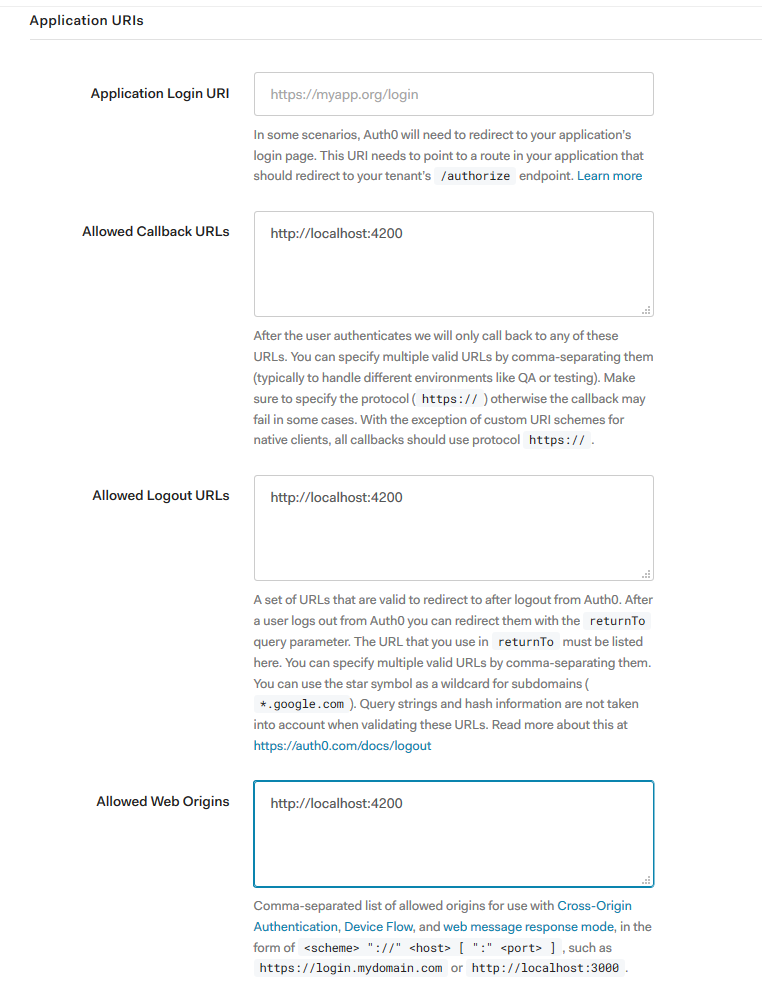
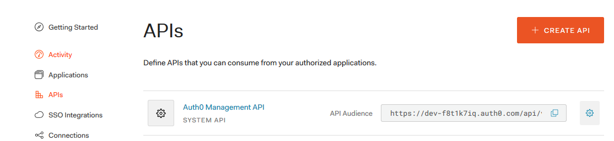
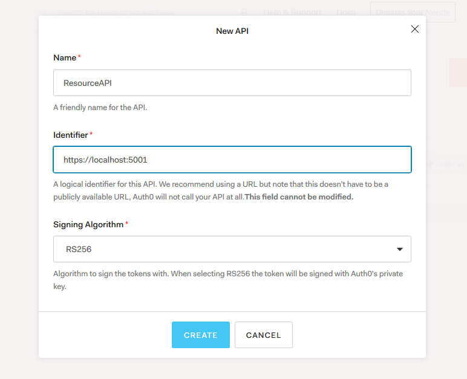

# Auth0 Client Credentials Grant for fullstack ASP.NET Core + Angular 9

1. Create new SPA application in Auth0 for Angular.




2. Set Allowed Callback URLs, Logout URLs and Web Origins to http://localhost:4200 - default it will be url address for Angular application.




3. Set AUTH_CONFIG in Angular's `auth.service.ts` data with ClientID, domain, callbackURL and apiURL.

```ts
const AUTH_CONFIG = {
  clientID: 'WlQO27ycF1JOW69gs6RobcdNUffCFBtC',
  domain: 'dev-f8t1k7iq.auth0.com',
  callbackURL: 'http://localhost:4200',
  apiUrl: 'https://localhost:5001'
};
```

4. Create new API. Fill identifier with your API url. Default it will be https://localhost:5001




5. Set data inside Resource Server - inside Startup.cs set:

```cs
.AddJwtBearer(options =>
{
    options.Authority = "https://dev-f8t1k7iq.auth0.com";
    options.Audience = "https://localhost:5001";
});
```

Values will be url to Auth0 API's page and set audience.

